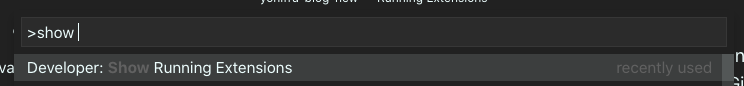
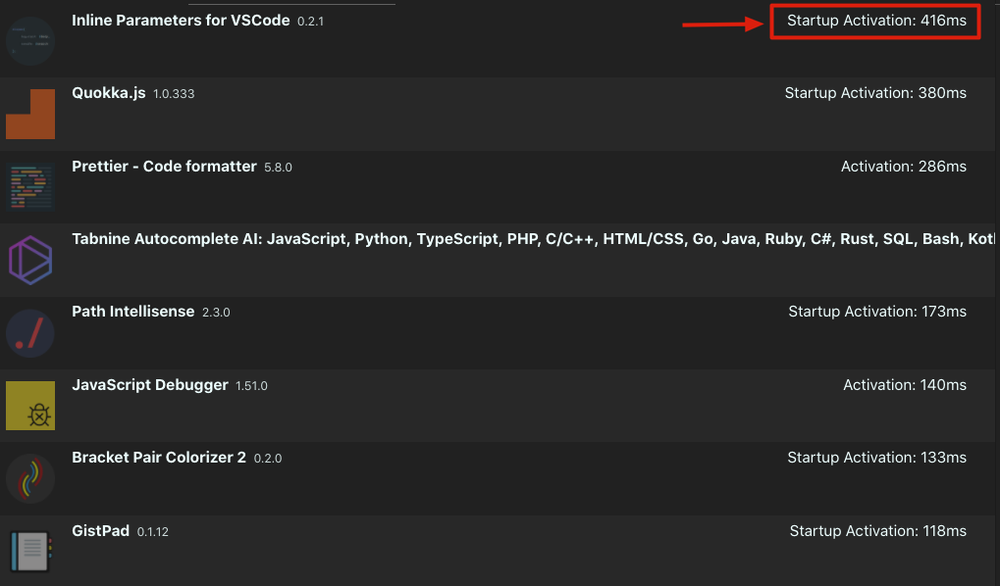

# **VS Code speed**

## Starting to feel the weight

I use VS code daily, and as such, I can sense when my IDE is acting up and starts to slow down on me.

## So how does it work?

Pressing `CMD + P` and then hitting `>` or simply pressing `CMD + SHIFT + P` will bring up the commands for VS code and the extensions you might have installed.
If you enter `Show running extensions` you'll see this option:

  

this means that when you'll hit Enter, you will get a very nice window that I recently found out about, that will give you some interesting
insights on your extensions:

  

This basically shows you which extension hogs your IDE the most. It divides into two categories:

* Startup Activation - Which is the amount of impact in `ms` that this extension has on your IDE activation time.
* Activation - Which is the amount of time it takes for the extension to load once your IDE is up.

Your aim is to see which extensions hogs your IDE the most, and try to either disable or uninstall them if you don't use them daily.

In general, it's a good practice to go over your extensions from time to time, and do a purge of the most unused extensions.

After this, I was able to get good performance on my snippets again, and VS code felt lightweight once more.
