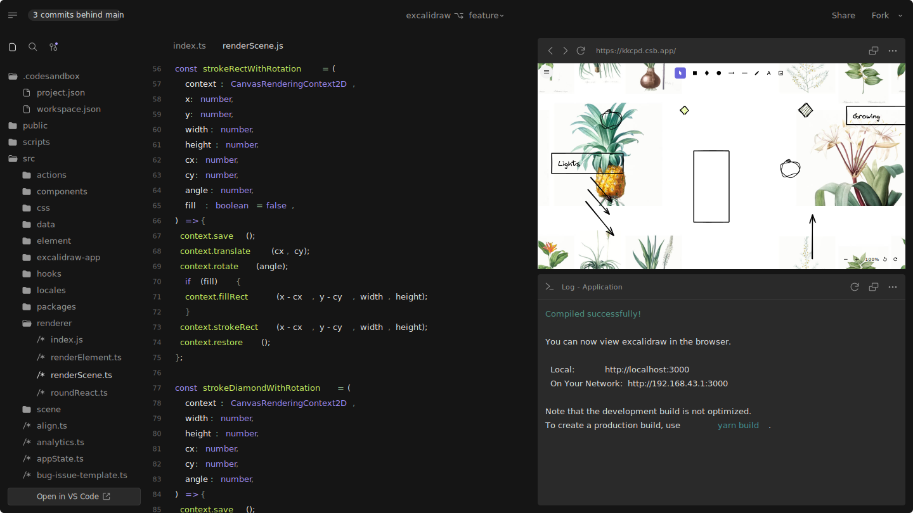
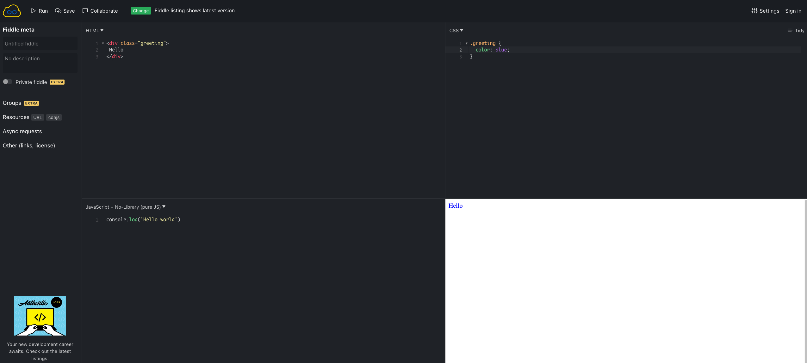
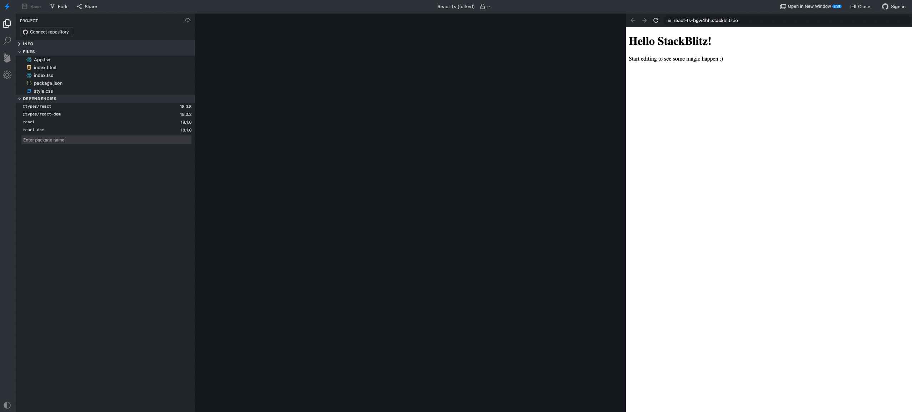
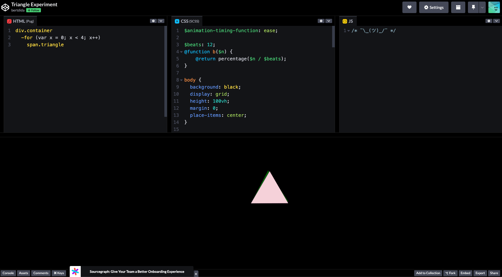
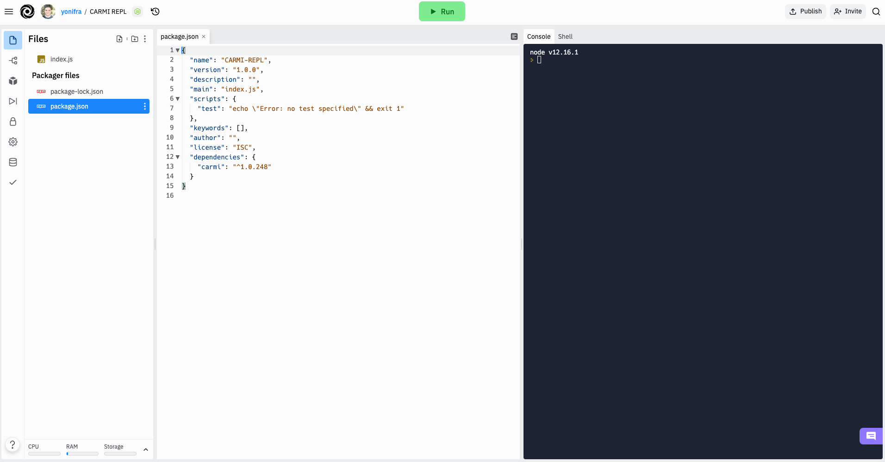

# **5 Ways to get up and running in no time**

## The blocker

You're sitting down, pondering about stuff, when all of a sudden - EUREKA! You have an idea, a solution to an interview question you were recently asked, or just want to try a new thing out or build something real quick to see if something works only to be blocked by a mountain of setups, configurations and installations that by the time you're done, your momentum is gone?

This happens to everybody, and the reason for this is that some programming languages and environments (such as Unity, for example), require you to have a bunch of prerequisites before even starting to write your first line of code.

Javascript (and Typescript, which is a superset of JS), allows you to quickly get up and running, but even for Javascript, you would need to clone React (or any other Frontend library you wish to use), wire some configurations and it can be quite overwhelming if you just want to try things out.

## No configuration solutions

Here is a list of websites and services that will allow you to get up and running in no time!

### [CodeSandbox.io](https://codesandbox.io) [FREE]

  

Codesandbox.io is probably the best known services on this list. It has extensive features, allows you to see your files, code , CSS and a browser-like live view of your changes, with a full console which is excellent for debugging.
It supports a wide variety of frameworks and libraries, such as React (both TS and JS support), Svelte, Angular, Gatsby, Next.js, Ember and many other technologies you can select from and immediately go into dev mode.
If you create an account (free), this will enable you to have many sandboxes, deploy to Vercel, publish on GitHub, and many more options.

### [JSFiddle](https://jsfiddle.net/) [FREE]

  

JSFiddle is a lightweight playground mainly for easily starting a website or, as the name implies, fiddling with Javascript and web development without the burden of setting up the files and hooking everything together.

JSFiddle allows you to have 4 windows, one will be your Javascript code editor, the other one your CSS file for styling, the third one will be your HTML file to display visual web elements, and the fourth one is intended for a preview of the end result.

Simple, clean and easy to use. However, this service lacks the advanced options that CodeSandbox has.

### [StackBlitz](https://stackblitz.com/) [FREE, Paid premium features]

  

StackBlitz offers a quick solution to spawn an full environment for the most popular stacks out there, such as Next.js, Vanilla TS / JS, React, Angular, RxJS and Vue.

Priding itself (and verified by me!) that it can boot a new environment for all the technologies mentioned above in mere milliseconds, it's a great free tool for quickly prototyping ideas, learning a new technology without the need for long and tedious setups or simply starting a new project without the hassle of doing all the hard work yourself.

### [CodePen](https://codepen.io/) [FREE]

  

CodePen, at least for me, started off as a good and easy way to prototype design concepts and ideas. Once logged in, CodePen allows you to either start by opening projects made by other CodePen users, or start fresh with a split editor (seen above) that allows you to edit three parts of a simple web application - HTML, CSS and Code (Javascript). This allows you to experiment with how these parts interact with each other, and by opening projects made by other professional web developers and designers, it allows you to see how complex CSS projects work and might inspire you to use them on your projects.

CodePen is one of the veterans out there, and you should definitely give it a try!

### [Replit Online IDE](https://replit.com/) [FREE]

  

Replit has been around for a while now, priding itself as an online IDE, it's a great tool to quickly create projects in a variety of programming languages, which are less common in the other services mentioned above, like C#, C++, Python, SQLite, Go, Bash, Lua, Clojure and of course the more common ones like React, JS, and the likes.

It's also a great way to try out in a sandbox environment libraries and tools, see if they fit on your project, and then just import it to your own personal projects. I personally have used Replit as a personal debugging for things that popped up at work and I wanted to test without having to spin up then big system we have, and instead do it locally, on the web, thus speeding up the prototyping process.

There are lots of other cool online services out there, in the next article we'll dive more into each and every one of these to understand the pros and cons of each one.